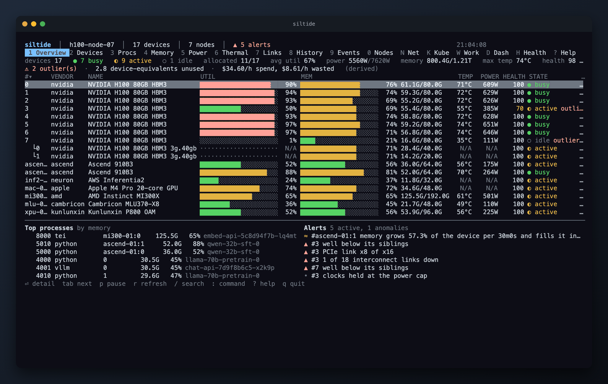

<p align="center">
  
</p>

<p align="center">
  <a href="https://github.com/mesutoezdil/siltide/actions/workflows/ci.yml"></a>
  <a href="https://github.com/mesutoezdil/siltide/releases"></a>
  <a href="go.mod"></a>
  <a href="LICENSE"></a>
</p>

siltide is a terminal monitor for AI accelerators from 15 vendors: GPUs, NPUs, XPUs, MLUs, DCUs, GCUs, and Apple silicon. It shows utilization, memory, processes, power, thermals, links, and health per device. History stays on disk. Pods and Slurm jobs sit next to processes. JSON and Prometheus cover fleets.

More on [the site](https://mesutoezdil.github.io/siltide/): every tab, every key, and screenshots.

<p align="center">
  
</p>

## Supported accelerators

The vendor list follows the device plugins in [HAMi](https://github.com/Project-HAMi/HAMi/tree/master/pkg/device), plus Apple and Intel. Every vendor is auto-detected. `--vendors nvidia,ascend` limits the probe. NVIDIA (an H100 SXM, driver 570.211.01, every metric checked against `nvidia-smi`) and Apple silicon (an M4 Pro) run on real hardware today. The rest are built against each vendor's documented tool output, with a fixture behind every parser. A hardware report through [an issue](https://github.com/mesutoezdil/siltide/issues/new/choose) is the fastest way to move one from "should work" to confirmed.

| Vendor | Devices | Source | Processes |
|---|---|---|---|
| NVIDIA | GPUs, MIG slices | NVML loaded with `dlopen` (no cgo), Xid events, NVLink, ECC, row remap, PCIe AER via sysfs | yes, with `/proc` enrichment |
| Apple | Apple silicon GPU | `ioreg`, IOReport (power, energy), SMC (temperature), AGX user clients (per-process GPU time) | yes |
| AMD | Instinct, Radeon | sysfs (`/sys/class/drm`) and DRM `fdinfo` | yes |
| Intel | Data Center GPU, Arc | sysfs and DRM `fdinfo` | yes |
| Huawei Ascend | NPUs | `npu-smi info` | yes |
| AWS | Inferentia, Trainium | `neuron-ls`, `neuron-monitor` | no |
| Cambricon | MLUs | `cnmon` | yes |
| Enflame | GCUs | `efsmi` | no |
| Hygon | DCUs | `hy-smi` (JSON) | no |
| Iluvatar CoreX | GPUs | `ixsmi -q -x` (XML) | no |
| Kunlunxin | XPUs | `xpu_smi` | no |
| MetaX | GPUs | `mx-smi` | no |
| Moore Threads | GPUs | `mthreads-gmi` | no |
| Biren | GPUs | `brsmi` | no |
| VastAI | VA series | PCI sysfs | no |

Fixture sources: [`testdata/SOURCES`](internal/provider/smi/testdata/SOURCES). A value is measured or shown as `N/A`, never guessed. A tool whose output fails to parse shows its error in the Health tab.

## Install

Every release and every push to `main` (pre-release `vX.Y.Z-main.N`) publishes binaries, packages, and images.

```sh
# Linux and macOS binary. checksums.txt sits next to it, and macOS
# needs its quarantine flag cleared: xattr -d com.apple.quarantine siltide
tag=$(curl -fsSL https://api.github.com/repos/mesutoezdil/siltide/releases | grep -m1 '"tag_name"' | cut -d '"' -f4)
curl -fsSL -o siltide "https://github.com/mesutoezdil/siltide/releases/download/$tag/siltide-linux-amd64"
chmod +x siltide && sudo mv siltide /usr/local/bin/

# deb or rpm, with completions and the man page
sudo dpkg -i siltide_*_amd64.deb   # or: sudo rpm -i siltide-*.x86_64.rpm

# One line: picks the build for this machine, checks it against the published
# checksums, and installs into /usr/local/bin (or ~/.local/bin)
( f="$(mktemp)" && trap 'rm -f "$f"' EXIT &&
  curl -fsSL https://raw.githubusercontent.com/mesutoezdil/siltide/main/packaging/install/install.sh -o "$f" &&
  sh "$f" )

# Homebrew (macOS and Linux)
brew install mesutoezdil/tap/siltide

# Go
go install github.com/mesutoezdil/siltide@latest

# Nix, without installing anything
nix run github:mesutoezdil/siltide -- --demo

# Container: headless collector with the API and /metrics on port 9800.
# --pid=host lets it see host processes, not just its own container.
docker run --rm -p 9800:9800 --gpus all --pid=host \
  -e NVIDIA_DRIVER_CAPABILITIES=utility ghcr.io/mesutoezdil/siltide:latest
```

A [systemd unit](deploy/systemd/siltide.service) and a [Kubernetes DaemonSet](deploy/kubernetes/daemonset.yaml) are in `deploy/`.
What siltide costs to run, and the scripts that measure it, are in [docs/PERFORMANCE.md](docs/PERFORMANCE.md).

## Quick start

```sh
siltide                      # interactive terminal UI, vendors auto-detected
siltide --demo               # explore every view with a simulated fleet
siltide --once               # one snapshot on stdout (exit code 3 when nothing was found)
siltide --once --json        # the same snapshot as JSON
siltide --json               # a stream of JSON snapshots, one per refresh
siltide --listen :9800       # the UI plus /api and /metrics
siltide --service            # headless collector for fleets and Prometheus
siltide --remote https://node:9800 --token ...   # the UI attached to a remote siltide
siltide --record run.jsonl   # record while running, siltide --replay run.jsonl plays it back later
siltide --status             # one line for tmux, i3bar, or a shell prompt
```

`siltide --status` prints, for the demo fleet: `17 dev · 59% util · 61% mem · 5035W · 74°C · health 98`.

## Configuration and more

`~/.config/siltide/config.yaml` or `--config path`, every key documented in [`examples/config.yaml`](examples/config.yaml). `siltide --print-config` shows what is active. `?` in the terminal lists every tab, key, and filter.

- **Fleets**: `siltide --service --listen 0.0.0.0:9800 --gen-token` on each node, then list them under `nodes:` on the machine you watch from, or reach a vendor CLI over `ssh` without installing siltide there. Off loopback, `--listen` needs TLS and a token unless `insecure: true`.
- **Kubernetes and Slurm**: pods and Slurm jobs show up next to processes on their own, from `/var/log/pods`, the kubelet pod-resources socket, or `scontrol`. The DaemonSet mounts what it needs.
- **API and Prometheus**: `--listen` serves `GET /api/snapshot`, `/api/summary`, `/api/events`, `/api/history?id=<device id>&n=600`, and Prometheus `/metrics` (`siltide_device_*` and `siltide_host_*` gauges), bearer-token authenticated.
- **Alerts**: built-in ones for temperature, throttling, outliers, idle-allocated devices, row remaps, and link degradation, plus your own rules under `alerts:`.
- **History**: plain-text hourly files, `--retention` to override how long, `--export` to CSV, `--record`/`--replay` to hand off an incident.
- **Themes**: `amber`, `default`, `dracula`, `ice`, `mono`, `solarized`, or your own in `~/.config/siltide/themes/` (see [`examples/themes/corp.yaml`](examples/themes/corp.yaml)).

## Building and testing

Go 1.26 or newer, no cgo: NVML and the macOS frameworks load at run time through [purego](https://github.com/ebitengine/purego).

```sh
make build          # bin/siltide
make check          # lint, race tests, and cross builds
make demo           # the simulated fleet
make test-fake-nvml  # the NVML ABI test against a fake driver (Linux, or Docker elsewhere)
make shots           # fleet screenshots under assets/, from the simulated fleet
make shots-mac       # Apple silicon screenshots, captured on the Mac that runs it
```

CI runs gofmt, vet for Linux and macOS, race tests, golangci-lint, and cross builds.

## Contributing

See [CONTRIBUTING.md](CONTRIBUTING.md) for how to add a vendor and what a change needs before it merges. Security reports: [SECURITY.md](SECURITY.md). Roadmap: the [issue list](https://github.com/mesutoezdil/siltide/issues). Changes: [CHANGELOG.md](CHANGELOG.md).

## License

Apache-2.0. See [LICENSE](LICENSE).
