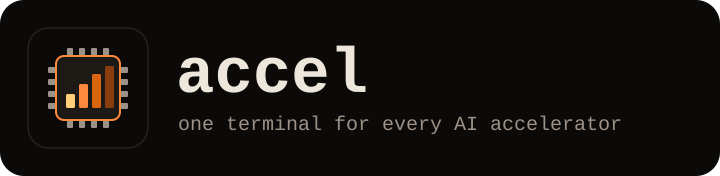
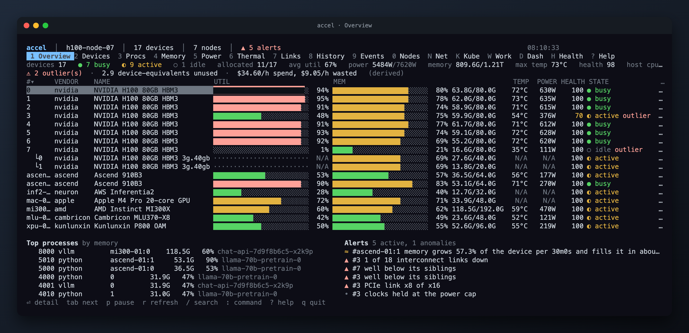
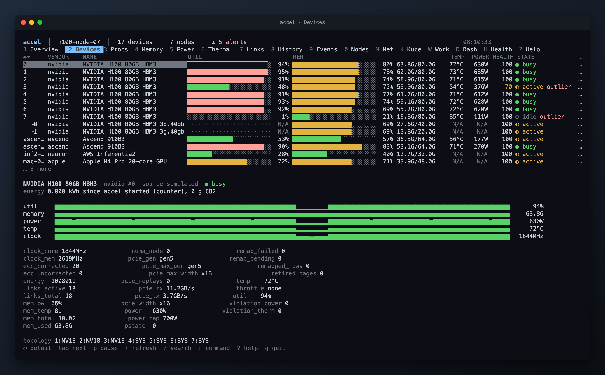
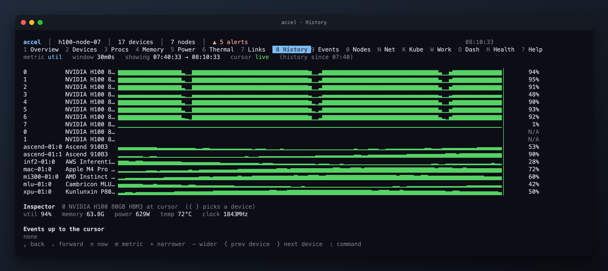
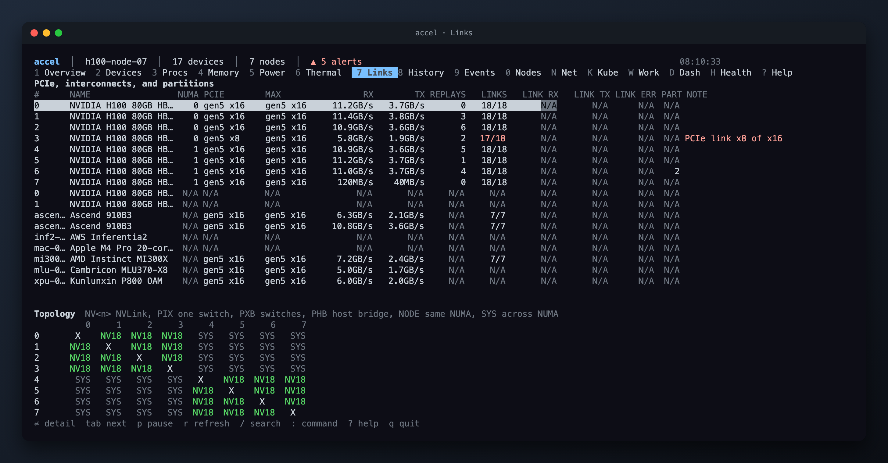
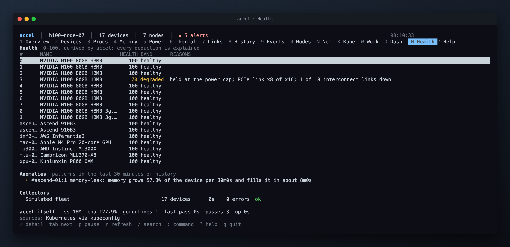

<p align="center">
  
</p>

<p align="center">
  <a href="https://github.com/mesutoezdil/accel/actions/workflows/ci.yml"></a>
  <a href="https://github.com/mesutoezdil/accel/releases"></a>
  <a href="go.mod"></a>
  <a href="LICENSE"></a>
</p>

accel is a terminal monitor for AI accelerators: GPUs, NPUs, XPUs, MLUs, DCUs, GCUs, and Apple silicon, from 15 vendors, in one interface. It shows utilization, memory, processes, power, thermals, links, and health per device, keeps a time machine on disk, correlates processes with Kubernetes pods and Slurm jobs, and serves the same data as JSON and Prometheus metrics for fleets.

<p align="center">
  
</p>

Every screenshot in this file is rendered from `accel --demo` by `make shots`, so the numbers are synthetic. The layout and the derived values (states, outliers, cost, health) are what you get on real hardware.

## Contents

- [Supported accelerators](#supported-accelerators)
- [Install](#install)
- [Quick start](#quick-start)
- [Views](#views)
- [Keys](#keys)
- [Configuration](#configuration)
- [Fleets](#fleets)
- [Kubernetes and Slurm](#kubernetes-and-slurm)
- [API and Prometheus](#api-and-prometheus)
- [Alerts](#alerts)
- [History, recording, and export](#history-recording-and-export)
- [Themes and keymaps](#themes-and-keymaps)
- [Building and testing](#building-and-testing)
- [Contributing](#contributing)
- [License](#license)

## Supported accelerators

The vendor list follows the device plugins in [HAMi](https://github.com/Project-HAMi/HAMi/tree/master/pkg/device), plus Apple and Intel. Every vendor is auto-detected; `--vendors nvidia,ascend` limits the probe.

| Vendor | Devices | Source | Processes | Status |
|---|---|---|---|---|
| NVIDIA | GPUs, MIG slices | NVML loaded with `dlopen` (no cgo), Xid events, NVLink, ECC, row remap, PCIe AER via sysfs | yes, with `/proc` enrichment | tested against a fake NVML library in CI; not yet run on an NVIDIA host |
| Apple | Apple silicon GPU | `ioreg`, IOReport (power, energy), SMC (temperature), AGX user clients (per-process GPU time) | yes | verified on an M4 Pro |
| AMD | Instinct, Radeon | sysfs (`/sys/class/drm`) and DRM `fdinfo` | yes | sysfs layout from kernel documentation; not yet run on hardware |
| Intel | Data Center GPU, Arc | sysfs and DRM `fdinfo` | yes | same as AMD |
| Huawei Ascend | NPUs | `npu-smi info` | yes | parser tested against captured output |
| AWS | Inferentia, Trainium | `neuron-ls`, `neuron-monitor` | no | parser tested against captured output |
| Cambricon | MLUs | `cnmon` | yes | parser tested against captured device rows |
| Enflame | GCUs | `efsmi` | no | parser tested against captured output (2 formats) |
| Hygon | DCUs | `hy-smi` (JSON) | no | parser tested against captured output |
| Iluvatar CoreX | GPUs | `ixsmi -q -x` (XML) | no | parser tested against captured output |
| Kunlunxin | XPUs | `xpu_smi` | no | parser tested against captured output |
| MetaX | GPUs | `mx-smi` | no | parser tested against captured output (2 formats) |
| Moore Threads | GPUs | `mthreads-gmi` | no | parser tested against captured output (2 formats) |
| Biren | GPUs | `brsmi` | no | flags from vendor documentation; no public sample, reported as unverified |
| VastAI | VA series | PCI sysfs | no | device presence only until the `vasmi` format is known |

Where each fixture came from is listed in [`internal/provider/smi/testdata/SOURCES`](internal/provider/smi/testdata/SOURCES). A vendor whose tool is installed but whose output we could not parse shows up in the Health tab with the error, never as a device with zeros. Every value in accel is either measured or shown as `N/A`.

Host metrics (CPU, memory, disks, network, InfiniBand) come from `/proc` and `/sys` on Linux and from `sysctl` and `vm_stat` on macOS.

## Install

Binaries, packages, and images are published on every release and on every push to `main` as a pre-release tagged `vX.Y.Z-main.N`.

**Release binary**

```sh
curl -fsSL -o accel https://github.com/mesutoezdil/accel/releases/latest/download/accel-linux-amd64
chmod +x accel && sudo mv accel /usr/local/bin/
```

Builds exist for `linux-amd64`, `linux-arm64`, `darwin-amd64`, and `darwin-arm64`. `checksums.txt` sits next to them.

**deb or rpm** (ships shell completions and the man page)

```sh
sudo dpkg -i accel_*_amd64.deb      # Debian, Ubuntu
sudo rpm -i accel-*.x86_64.rpm      # RHEL, Fedora, SUSE
```

**Homebrew** (macOS and Linux)

```sh
brew install mesutoezdil/tap/accel
```

The [tap](https://github.com/mesutoezdil/homebrew-tap) re-renders its formula from the newest release every 6 hours; until the first stable release it points at the newest `main` pre-release.

**Go**

```sh
go install github.com/mesutoezdil/accel@latest
```

**Container** (headless collector with the API and `/metrics` on port 9800)

```sh
docker run --rm -p 9800:9800 --gpus all ghcr.io/mesutoezdil/accel:latest
```

Vendor CLIs (`npu-smi`, `cnmon`, and the rest) must be visible inside the container for their devices to appear. A [systemd unit](deploy/systemd/accel.service) and a [Kubernetes DaemonSet](deploy/kubernetes/daemonset.yaml) are in `deploy/`.

## Quick start

```sh
accel                      # interactive terminal UI, vendors auto-detected
accel --demo               # explore every view with a simulated fleet
accel --once               # one snapshot on stdout (exit code 3 when nothing was found)
accel --once --json        # the same snapshot as JSON
accel --json               # a stream of JSON snapshots, one per refresh
accel --listen :9800       # the UI plus /api and /metrics
accel --service            # headless collector for fleets and Prometheus
accel --remote https://node:9800 --token ...   # the UI attached to a remote accel
accel --record run.jsonl   # record while running; accel --replay run.jsonl plays it back
accel --status             # one line for tmux, i3bar, or a shell prompt
```

`accel --status` prints, for the demo fleet:

```
17 dev · 59% util · 61% mem · 5035W · 74°C · health 98
```

## Views

16 tabs, switched with the key shown in the tab bar or with the mouse. Tabs with nothing to show (Links without link data, Kubernetes without a pod source, Network without interfaces) hide themselves.

| Key | Tab | What it shows |
|---|---|---|
| `1` | Overview | fleet summary, every device with utilization and memory bars, top processes, active alerts, spend and waste per hour |
| `2` | Devices | the device table plus a detail pane: sparklines, every metric with its unit and provenance, processes on the selected device |
| `3` | Processes | every process across devices with user, pod, job, memory, utilization, and runtime; sortable by any column |
| `4` | Memory | used, total, bandwidth, ECC counters, row remaps, retired pages |
| `5` | Power | draw, cap, energy since start, throttle reasons, power violations |
| `6` | Thermals | core and memory temperature, fan, thermal violations, warning threshold |
| `7` | Links | PCIe generation and width, NUMA node, RX and TX rates, replays, NVLink counts and errors, and the topology matrix |
| `8` | History | the time machine: every device as a sparkline over a zoomable window, a cursor to scrub, an inspector at the cursor, events up to the cursor |
| `9` | Events | Xids, link changes, throttle episodes, process starts and stops, alerts; filterable |
| `0` | Nodes | one row per node in a fleet with per-node totals; `ctrl+n` and `ctrl+p` cycle nodes in every other tab |
| `N` | Network | host interfaces and InfiniBand ports with rates, errors, and drops |
| `K` | Kubernetes | pods on this node with their devices, requests, and idle-allocated time; `d` describes, `l` shows logs |
| `W` | Workloads | Deployments, StatefulSets, Jobs, and Slurm jobs with devices held, efficiency, cost, kWh, and CO2 |
| `D` | Dashboard | fleet counters, a wide history chart, and the reliability table (Xid, ECC, remap, replays, violations, energy, link errors, health) |
| `H` | Health | the 0-100 score per device with every deduction explained, collector latency and errors, accel's own resource use |
| `?` | Help | keys, filter syntax, and the command list |

<p align="center">
  
</p>

<p align="center">
  
</p>

<p align="center">
  
</p>

<p align="center">
  
</p>

Derived values are labeled "(derived)" in the interface: device states (busy, active, idle, down, idle-allocated), outliers (a device well below its siblings), placement hints (which free devices share an NVLink or NUMA domain), anomalies on history (utilization collapse, memory leak slope, temperature creep), and the health score.

## Keys

The defaults; every action can be rebound in the config (see [Themes and keymaps](#themes-and-keymaps)).

| Keys | Action |
|---|---|
| `q`, `ctrl+c` | quit |
| `tab`, `right`, `]` and `shift+tab`, `left`, `[` | next and previous tab |
| `up`/`k`, `down`/`j`, `pgup`/`ctrl+u`, `pgdown`/`ctrl+d`, `home`/`g`, `end`/`G` | move in tables |
| `enter`, `esc` | open detail, go back |
| `p`, `space` | pause the display (collection continues) |
| `r` | refresh now |
| `/` | search; the filter language takes `dev:`, `user:`, `ns:`, `pod:`, `sev:`, `kind:`, and free text |
| `:` | command bar with Tab completion (`:theme dracula`, `:window 1h`, `:compare 0 3`, `:ns inference`, and more; `?` lists them) |
| `s`, `S` | sort by the next column, reverse the sort; a header click does the same |
| `,` and `.`, `<` and `>` | scrub history by 1 or 30 points |
| `n` | back to live |
| `m`, `M` | next and previous history metric |
| `+`/`=`, `-` | narrower and wider history window |
| `{`, `}` | previous and next device in History and Dashboard |
| `d`, `l`, `c`, `w` | describe pod, pod logs, next container, wrap long lines |
| `D` | jump to the Dashboard |
| `ctrl+n`, `ctrl+p` | next and previous node |
| `ctrl+e` | export the current table as CSV |

The mouse works everywhere: click a tab, a row, or a column header, double-click a row for its detail, use the wheel to scroll the table or the detail pane under the pointer. Hold Shift to select text in the terminal.

## Configuration

`~/.config/accel/config.yaml`, or `--config path`. Every key is optional and unknown keys are rejected with their line number. [`examples/config.yaml`](examples/config.yaml) documents every key with its default; `accel --print-config` prints the effective result.

```yaml
refresh: 1s
history:
  keep: 24h
  resolution: 5s
thresholds:
  idle_util: 5
  busy_util: 80
  idle_after: 5m
  temp_warn: 85
cost:
  per_hour:
    "H100": 3.50
    "MI300X": 3.00
carbon:
  g_per_kwh: 400
```

State (history, the debug log) lives under `~/.local/state/accel`.

## Fleets

One accel per node serves its data; another accel shows them all.

On each node:

```sh
accel --gen-token                          # prints a token and its SHA-256 digest
accel --service --listen 0.0.0.0:9800 --token sha256:<digest> \
      --config /etc/accel/config.yaml      # with tls.cert and tls.key set
```

On your machine:

```yaml
nodes:
  - name: gpu-node-01
    url: https://gpu-node-01:9800
    token_file: ~/.config/accel/tokens/gpu-node-01
    ca: ~/.config/accel/ca.pem
  - name: hpc-07              # no accel installed there: vendor CLIs over ssh
    ssh: root@hpc-07
    key: ~/.ssh/id_ed25519
```

Remote and local devices appear in the same tables with a node column; the Nodes tab sums them. The SSH provider runs the vendor CLI on the remote host through the system `ssh` client and parses it with the same code, so it covers the CLI vendors (Ascend, Cambricon, Enflame, Hygon, Iluvatar, Kunlunxin, MetaX, Moore Threads, Biren). NVIDIA, AMD, Intel, and Neuron need accel on the node.

Listening on anything other than loopback requires TLS plus a token; `insecure: true` overrides that for networks you trust. The token is stored as a digest, so the plaintext never sits in a config file. Command lines are stripped from `/api/snapshot`.

## Kubernetes and Slurm

Processes are mapped to pods from the container log directory (`/var/log/pods`) whenever it exists. When in-cluster credentials or a kubeconfig are available (`kubernetes.kubeconfig` and `kubernetes.context` in the config, then `KUBECONFIG`, then `~/.kube/config`) the API server adds owner references, container names, and requests. Exec credential plugins are not run; such clusters stay on the log directory. Separately, the kubelet pod-resources socket (`/var/lib/kubelet/pod-resources/kubelet.sock`) tells which pod holds which device, including pods with no running process. The DaemonSet in `deploy/kubernetes/` mounts all of this.

On Slurm nodes the job ID comes from the process cgroup and the job's name, user, and GRES allocation from `scontrol`. Jobs show up in the Workloads tab next to Kubernetes owners.

## API and Prometheus

With `--listen` or `listen:` in the config:

| Path | Content |
|---|---|
| `GET /healthz` | `ok` |
| `GET /api/snapshot` | the latest snapshot: devices, processes, host, alerts, fleet totals |
| `GET /api/summary` | counts and totals only |
| `GET /api/events` | the event log |
| `GET /api/history?id=<device id>&n=600` | the last `n` points of utilization, memory, temperature, power, and core clock for one device |
| `GET /metrics` | Prometheus text format |

Send the token as `Authorization: Bearer <token>`. Metrics are gauges named `accel_device_*` with `node`, `vendor`, `index`, `id`, and `name` labels: `accel_device_util_percent`, `accel_device_memory_used_bytes`, `accel_device_power_watts`, `accel_device_temperature_celsius`, `accel_device_energy_joules_total`, `accel_device_ecc_uncorrected_total`, `accel_device_pcie_replays_total`, `accel_device_links_active`, `accel_device_health_score`, and more. Host gauges are `accel_host_*`. A metric a vendor does not report is simply absent.

`--json` without `--once` streams one snapshot per refresh, which is the same format `--record` writes and `--replay` reads.

## Alerts

Built-in rules cover temperature at or above `temp_warn`, thermal throttling, clocks held at the power cap, hardware slowdown, outliers, idle-allocated devices, pending or failed row remaps, a PCIe link narrower than its maximum, and interconnect links down. Each one needs 2 consecutive samples to raise or clear. Add your own:

```yaml
alerts:
  min_severity: warning
  resend: 1h
  webhook: https://hooks.example.com/accel        # POST {"host", "alerts": [...]}
  slack: https://hooks.slack.com/services/...
  alertmanager: http://alertmanager:9093
  rules:
    - name: wasted
      when: "util < 10"          # <metric> <op> <value>; memory values take K, M, G, T
      for: 10m
      on: allocated              # "", allocated, or idle
      severity: warning
    - when: "health < 50"
      severity: critical
```

## History, recording, and export

History is written as plain-text hourly files with a CRC per line, capped by `history.max_disk_mb`, and reloaded on start. `--retention 168h` overrides `history.keep`. `accel --export history.csv` writes it as CSV. `--record` appends every snapshot to a file and `--replay` drives the interface from it, which is a way to hand an incident to someone else.

## Themes and keymaps

Built-in themes: `amber`, `default`, `dracula`, `ice`, `mono`, `solarized` (`accel --list-themes`). A file in `~/.config/accel/themes/<name>.yaml` can `extends` one of them and override any of the 19 color roles; [`examples/themes/corp.yaml`](examples/themes/corp.yaml) is a starting point. `colors:` in the config overrides single roles and `transparent: true` keeps the terminal background.

```yaml
keys:
  quit: "q,ctrl+c"
  command: ";"
```

## Building and testing

Go 1.26 or newer. No cgo anywhere: NVML and the macOS frameworks are loaded at run time with [purego](https://github.com/ebitengine/purego).

```sh
make build        # bin/accel
make check        # lint, race tests, and cross builds
make demo         # the simulated fleet
make test-fake-nvml   # the NVML ABI test against a fake driver (Linux, or Docker elsewhere)
go run ./scripts/shots   # regenerate the screenshots under assets/
```

CI runs gofmt, `go vet` for Linux and macOS, race tests, golangci-lint, and static cross builds on every push. The fake NVML test compiles a C library that answers the NVML calls accel makes, so the ABI structs are checked without hardware.

## Contributing

See [CONTRIBUTING.md](CONTRIBUTING.md) for how to add a vendor and what a change needs before it merges. Security reports: [SECURITY.md](SECURITY.md). The roadmap is [TODO.md](TODO.md).

## License

Apache-2.0. See [LICENSE](LICENSE).
