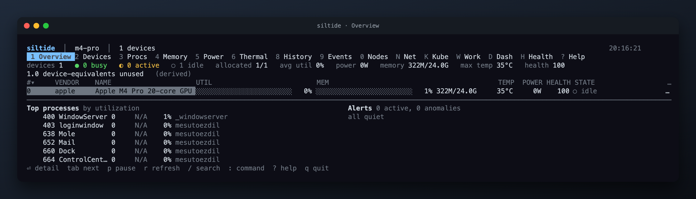
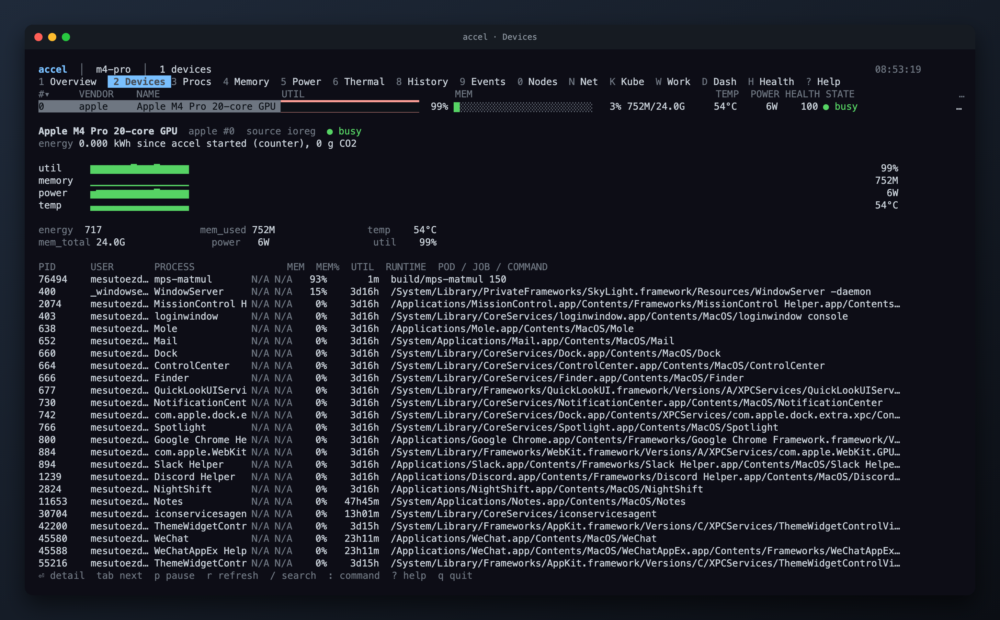

# Screenshots

The fleet images come from `make shots` (the simulated fleet). The Apple silicon images come from `make shots-mac`, captured on a MacBook Pro with an M4 Pro under a Metal matrix-multiply load.

## Apple silicon

## Fleet

Devices, with the detail pane for the selected device:

History, the time machine:

Links, with the topology matrix:

Health, with every deduction explained:

The other tabs, as SVG: [Processes](assets/processes.svg), [Memory](assets/memory.svg), [Power](assets/power.svg), [Thermals](assets/thermals.svg), [Events](assets/events.svg), [Nodes](assets/nodes.svg), [Network](assets/network.svg), [Kubernetes](assets/kubernetes.svg), [Workloads](assets/workloads.svg), [Dashboard](assets/dashboard.svg), [Help](assets/help.svg).
